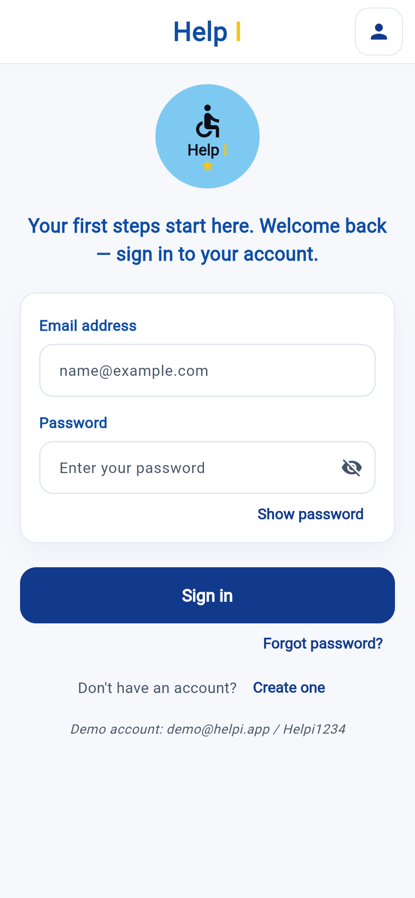
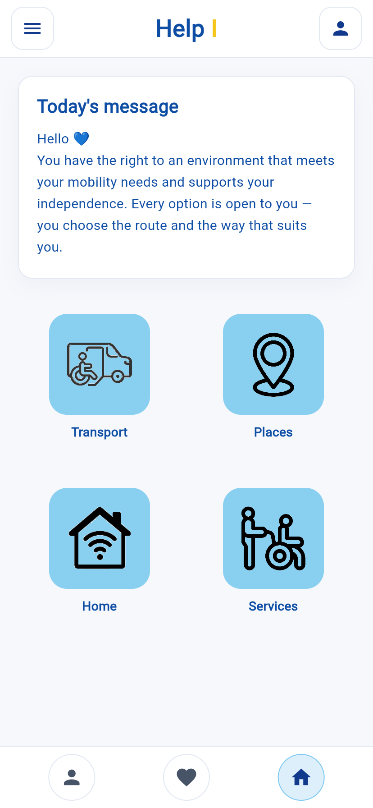
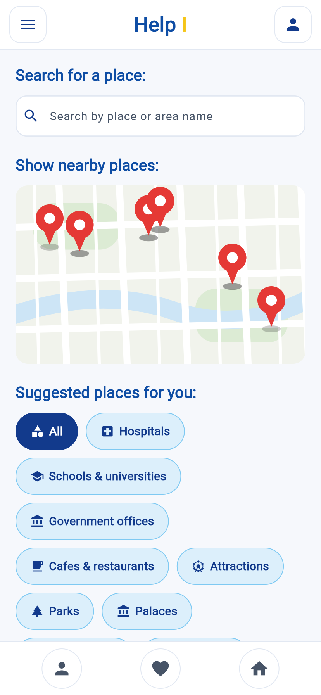
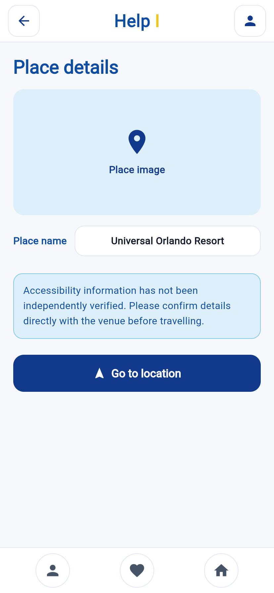
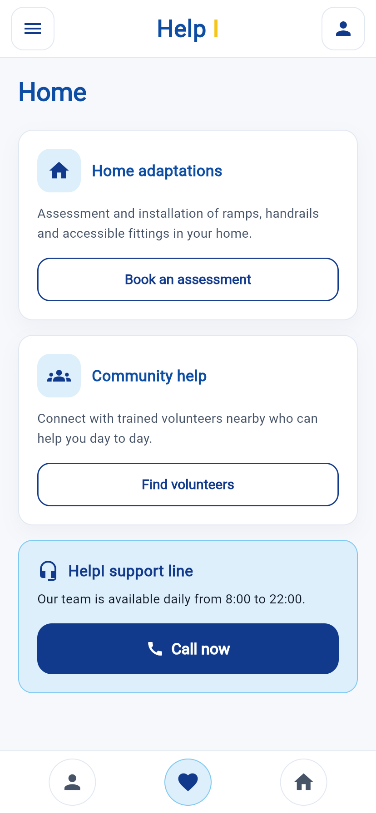
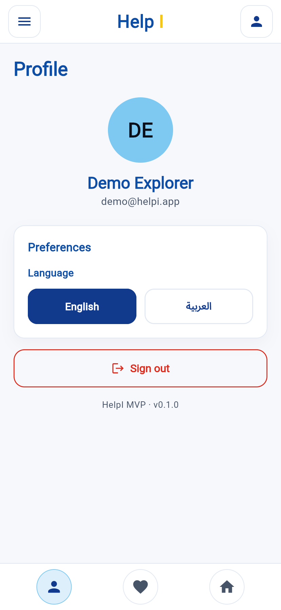
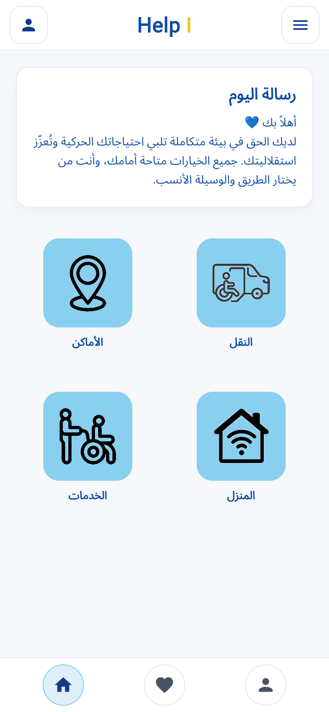

# HelpI

**Accessibility & urban mobility companion** — *know before you go.*

HelpI helps people with reduced mobility plan a trip with confidence: it shows
nearby places with verified accessibility features, accessible transport
options, and a community support layer, in Arabic and English.

Built with **Flutter + Dart**, **Clean Architecture** and **flutter_bloc**.

---

## Screenshots

<table>
  <tr>
    <td align="center"><br><sub><b>Sign in</b></sub></td>
    <td align="center"><br><sub><b>Dashboard</b></sub></td>
  </tr>
  <tr>
    <td align="center"><br><sub><b>Accessibility map</b></sub></td>
    <td align="center"><br><sub><b>Place details</b></sub></td>
  </tr>
  <tr>
    <td align="center"><br><sub><b>Services</b></sub></td>
    <td align="center"><br><sub><b>Profile · language switch</b></sub></td>
  </tr>
  <tr>
    <td align="center" colspan="2"><br><sub><b>العربية — full RTL mirror</b></sub></td>
  </tr>
</table>

---

## Why HelpI

A ramp that isn't there, a lift that is out of service, a "step-free" entrance
that has three steps — a wrong assumption can end a trip before it starts.
HelpI surfaces the accessibility facts *before* someone leaves home.

## Features

| | Feature |
| --- | --- |
| 🗺️ **Accessibility map** | Search + category filters (all, hospitals, schools, government offices, cafes) over an interactive map, with distance, rating and accessibility badges per place. |
| ♿ **Place details** | Photo, distance, rating and verified features — ramp, accessible restroom, wide elevator, wide doors — plus **Go to location**, which hands off to the user's maps app. |
| 🚌 **Transport** | Request an accessible ride that matches the user's mobility needs. |
| 🏠 **Home adaptations** | Book an assessment for ramps, handrails and accessible fittings at home. |
| 🤝 **Community help** | Connect with trained volunteers nearby, plus a daily support line. |
| ➕ **Contribute a place** | Anyone can add a venue and flag its accessibility features so the map improves for everyone. |
| 🌐 **Arabic + English** | Full RTL/LTR support with a one-tap language switch, persisted across restarts. |
| 🔐 **Accounts** | Validated sign-in / sign-up with local persistence and session restore. |

## Screens

Splash/Welcome → Login · Register → Dashboard → Accessibility Map → Place
Details, plus Add Place, Profile and Services.

## Accessibility commitments

- **48×48 dp** minimum touch target on every interactive control (WCAG 2.5.5).
- Text colours meet **WCAG AA** contrast against their backgrounds.
- Icon-only controls carry **semantics labels and tooltips** — never colour
  alone to convey state (selected chips change fill *and* weight).
- Automatic **RTL mirroring** in Arabic; the brand wordmark stays LTR.

## Tech stack

- **Flutter / Dart** (null safety, Material 3)
- **State management:** `flutter_bloc` (Cubits + BLoCs)
- **Architecture:** Clean Architecture — `domain` · `data` · `presentation`
  per feature, with a single composition root (`core/di/app_container.dart`)
- **Localization:** ARB files + `flutter gen-l10n`
- **Maps:** `google_maps_flutter` with a built-in vector fallback surface
- **Persistence:** `shared_preferences`

```
lib/
├── main.dart · app.dart        # entry point + providers + MaterialApp
├── core/                       # theme, routing, DI, shared widgets, l10n glue
├── features/
│   ├── auth/                   # session, sign-in, register  (domain/data/presentation)
│   ├── places/                 # map, details, add place
│   ├── dashboard/              # daily message + module grid
│   └── profile/                # profile + services
└── l10n/                       # app_en.arb · app_ar.arb (+ generated/)
```

## Getting started

```bash
flutter pub get      # also generates lib/l10n/generated/
flutter analyze
flutter run
```

> Missing generated localizations? Run `flutter gen-l10n`.

### Demo account

| Field | Value |
| --- | --- |
| Email | `demo@helpi.app` |
| Password | `Helpi1234` |

### Google Maps API key

The map renders a built-in vector surface out of the box (and on desktop,
where the Google Maps plugin has no implementation), so nothing is ever blank.
To switch to the real `GoogleMap` on Android / iOS / web:

1. Create a key with **Maps SDK for Android / iOS / JavaScript API** enabled.
2. Add it to `android/app/src/main/AndroidManifest.xml`
   (`com.google.android.geo.API_KEY`) and `ios/Runner/Info.plist`
   (`GMSServicesProvideAPIKey`).
3. Set `AppConfig.useGoogleMaps = true` in `lib/core/config/app_config.dart`.

## Roadmap

- Real backend (places + accounts) behind the existing repository contracts
- Turn-by-turn accessible route planning
- Place photo gallery and community reviews
- Offline caching of favourited places

---

*Built as an MVP for hackathon submission.*
